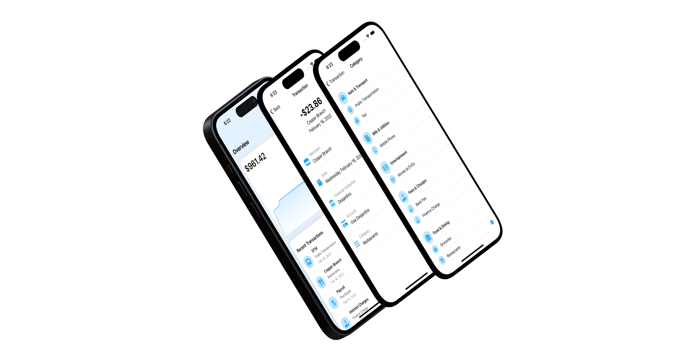

# ExpenseTracker
ExpenseTracker can be used to easily view and manage expenses. Features include the cumulative total shown by an interactive chart, a list of every purchase sectioned by month, and mutable categories for each expense.

